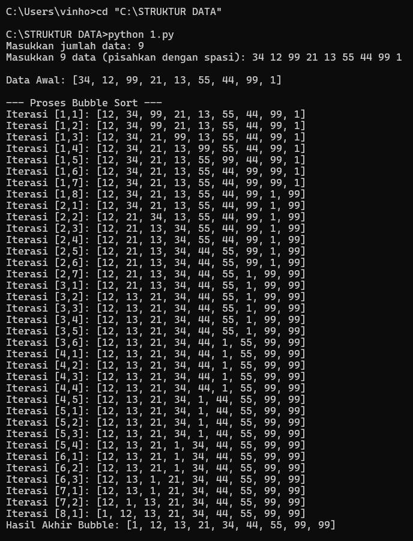
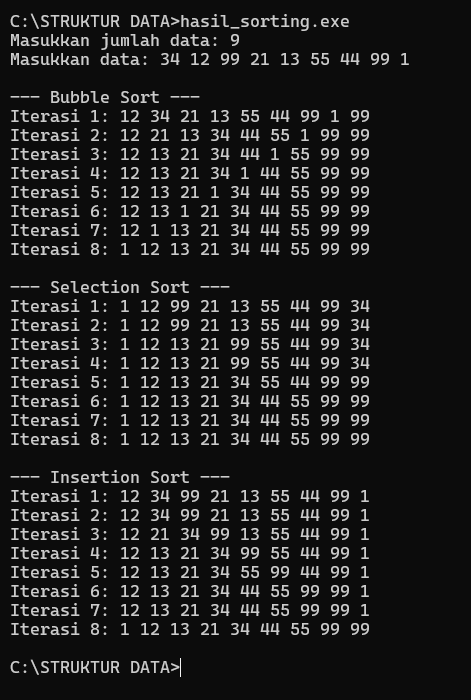

# Tugas Implementasi Algoritma Sorting

Repositori ini berisi implementasi 5 algoritma pengurutan (Sorting) menggunakan bahasa pemrograman Python dan C++.

## Algoritma yang Diimplementasikan:
1. Bubble Sort
2. Selection Sort
3. Insertion Sort
4. Quick Sort
5. Merge Sort

## Hasil Demo Program
Berikut adalah tampilan proses iterasi pada setiap bahasa pemrograman:

### 1. Tampilan Python
 
.png)
> Menampilkan detail setiap perbandingan elemen.

### 2. Tampilan C++

> Menampilkan hasil data setelah setiap putaran iterasi utama.

## Cara Menjalankan
- **Python**: `python 1.py`
- **C++**:`hasil.exe` (Windows)
